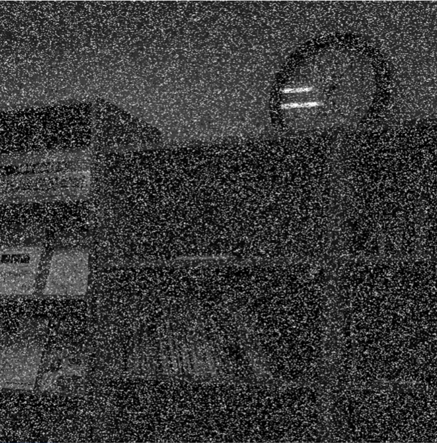
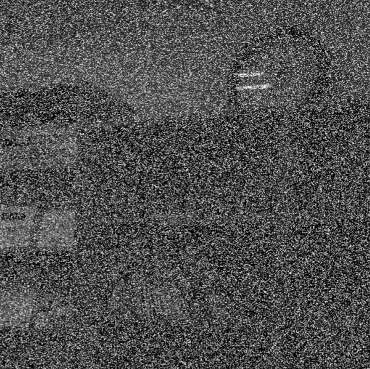
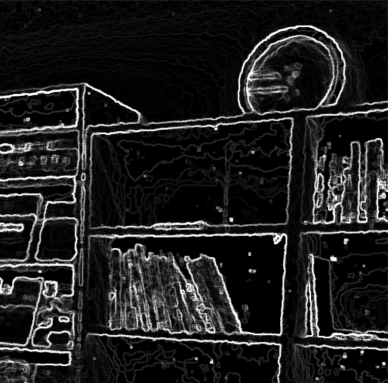
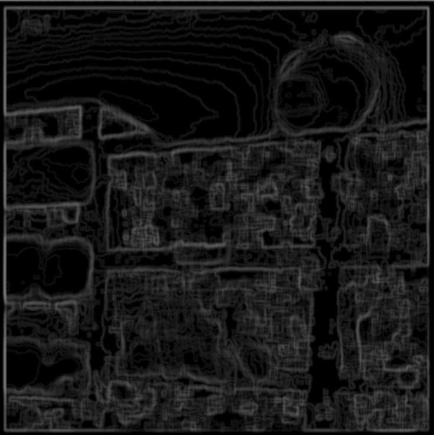
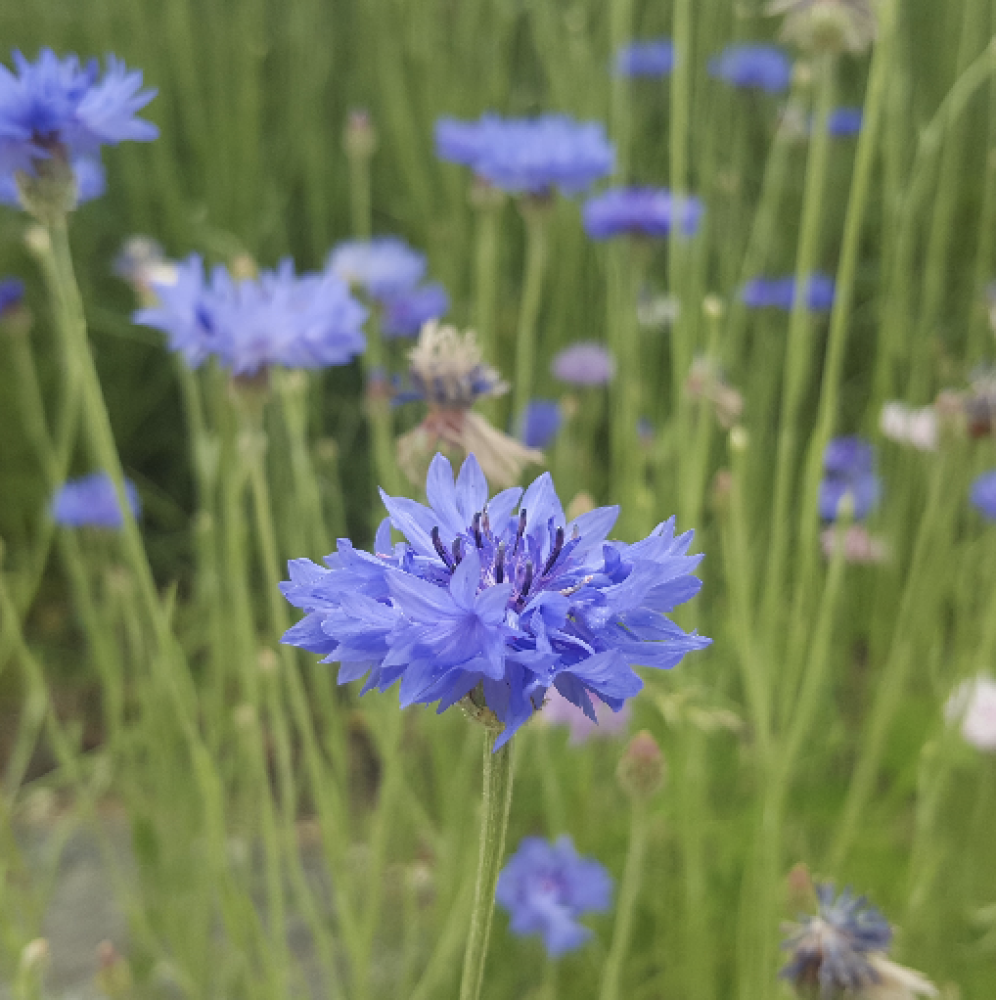
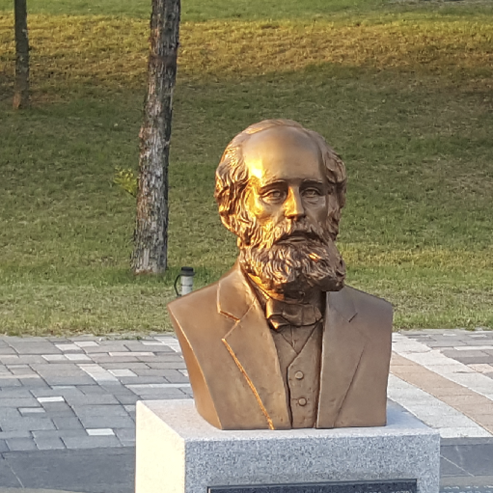
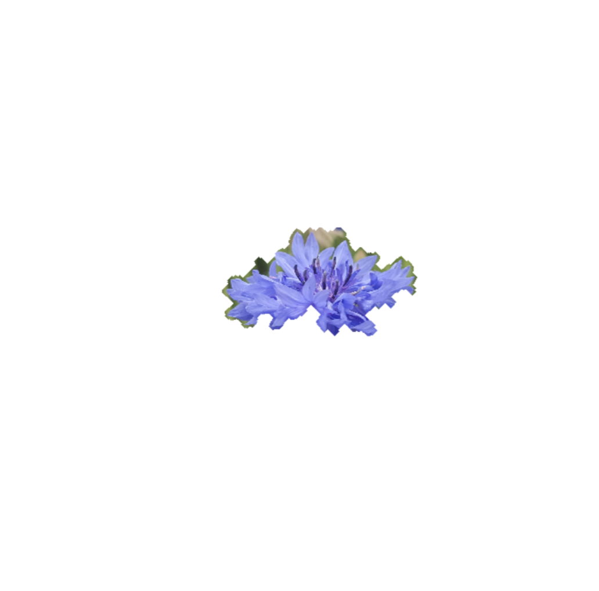
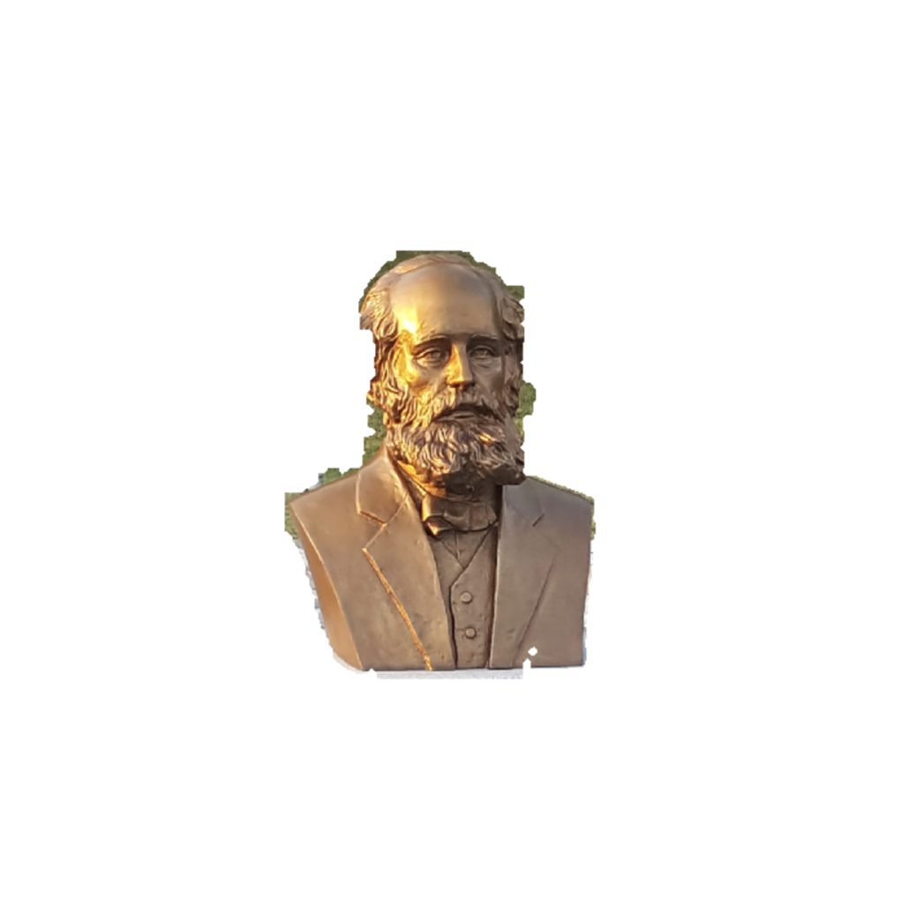

<h1>Edge Extraction</h1>

This project aims to extract edges in the 2D images with noise. The edge extraction algorithm is implemented using histogram equalization and filter kernel(Gaussian filter, median filter, sobel filter, etc)
 
<h3>The images used as input:</h3>
 
   
 
 
<h3>Results:</h3>
 
 

<h1>Image segmentation</h1>

In this project, a image segmentation algorithm that segments region of interest(ROI) is implemented. The algorithm is a combination of thresholding(using intensity of pixels), dilation and erosion(morphological operations).
 

<h3>The images used as input:</h3>
 
 
 
 
<h3>Results:</h3>
 
 

